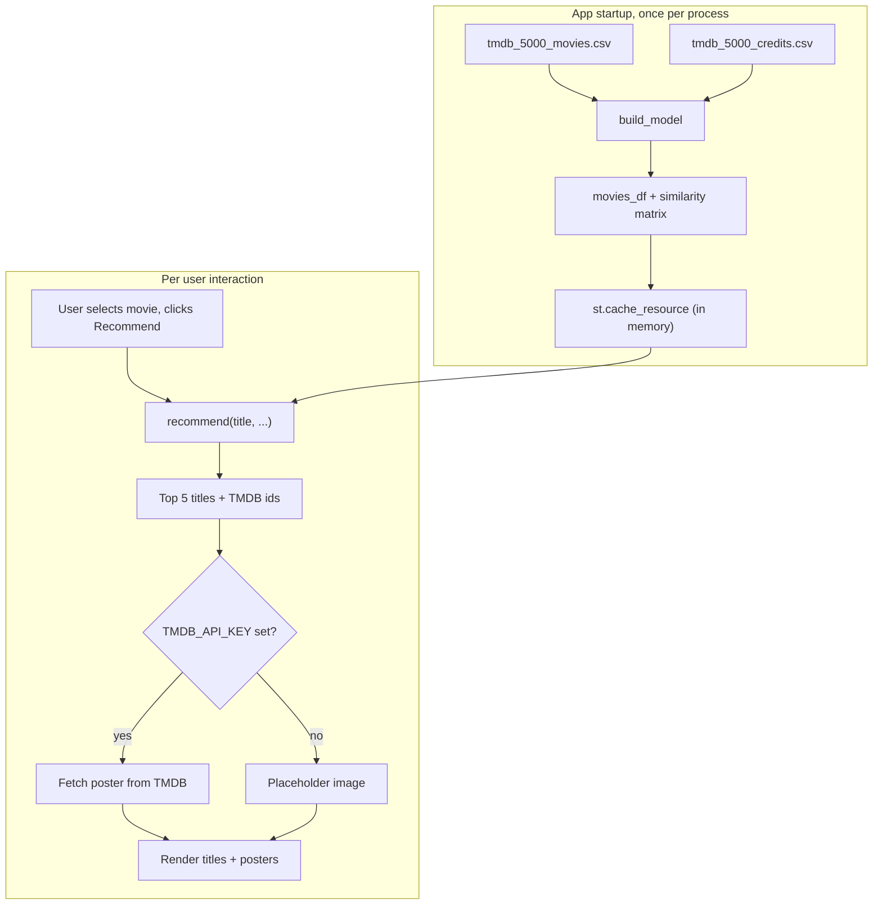
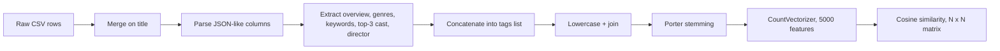
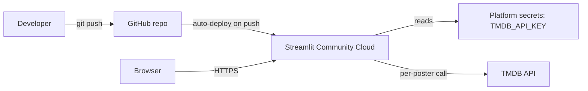

# Architecture
## Movie Recommender (AI/ML)

## 1. Overview

A single-process, stateless web application. No database, no separate
backend API, no persistent storage beyond two source CSVs shipped in the
repo. The entire system runs as one Streamlit process per deployment.

## 2. Components

### 2.1 `recommender.py` — data & model layer

No knowledge of Streamlit or UI. Two public functions:

- **`build_model()`** — reads both CSVs, merges, extracts/normalizes
  features, builds per-movie tag strings, stems, vectorizes with
  `CountVectorizer`, computes the full cosine similarity matrix. Returns
  `(movies_df, similarity_matrix)`.
- **`recommend(movie_title, movies_df, similarity, top_n=5)`** — looks up
  the title's row, sorts by similarity score, returns top N as
  `(title, tmdb_id)` tuples. Returns `[]` if not found.

File paths resolve relative to `recommender.py`'s own location, not the
process's working directory — deliberate, see gap analysis item on the
original path bug.

### 2.2 `app.py` — presentation layer

Delegates all data/model logic to `recommender.py`. Responsibilities:
reads `TMDB_API_KEY` from env/`st.secrets` with no hardcoded fallback;
wraps `build_model()` in `@st.cache_resource`; renders the UI; handles
poster fetch failures defensively (`fetch_poster()` never raises).

### 2.3 Data files

`tmdb_5000_movies.csv` and `tmdb_5000_credits.csv` — static, versioned,
read fresh at every process startup.

## 3. Feature engineering pipeline

Each movie is a single sparse vector in a 5,000-dimension bag-of-words
space; similarity is the cosine of the angle between two vectors.

## 4. Deployment architecture

Streamlit Community Cloud manages port/host/proxy config itself — no
`Procfile`/`setup.sh` needed (both existed for a prior Heroku target and
were removed).

## 5. Why runtime model-building instead of prebuilt artifacts

A prior version pickled the model and loaded it at runtime. Removed
because: the pickled files were fragile to commit correctly (one became
an unresolved Git LFS pointer, the other was split into unusable chunks —
see `08-gap-analysis.md`); the dataset is small enough (~4,800 rows) that
rebuilding costs ~20s once per process, not per request; and it removes
an entire class of "works on my machine, not on a fresh clone" bugs.

## 6. Extension points

- **Swapping the similarity model** (e.g. TF-IDF): isolated inside
  `build_model()`.
- **Adding evaluation**: a new module importing `build_model()`/
  `recommend()` directly.
- **Splitting UI from logic**: `recommender.py` has no Streamlit
  dependency and could be wrapped by a FastAPI/Flask layer unchanged.